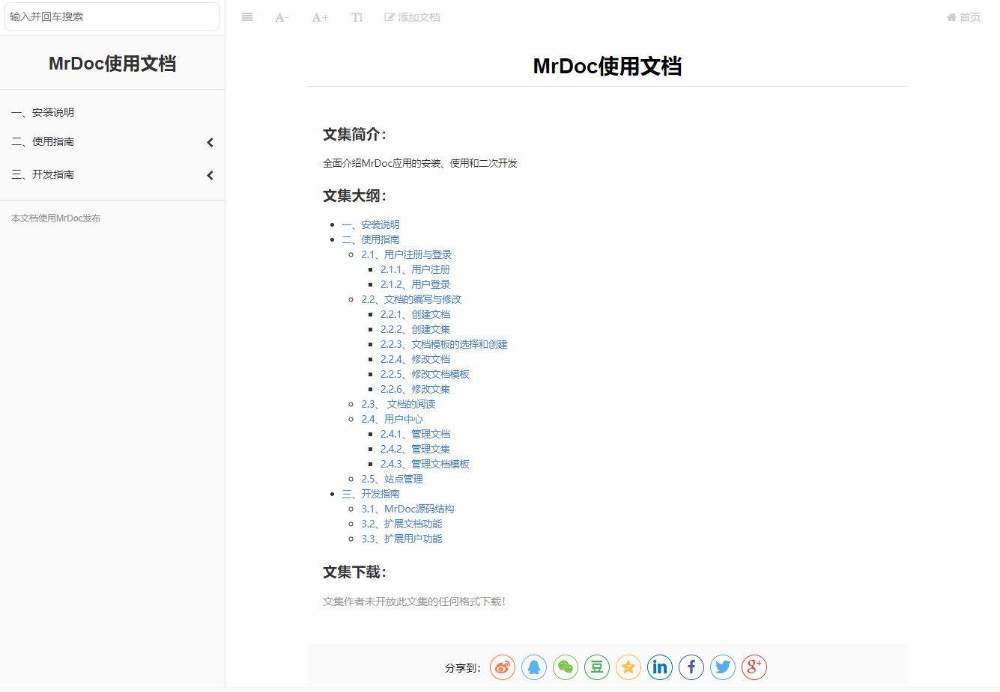
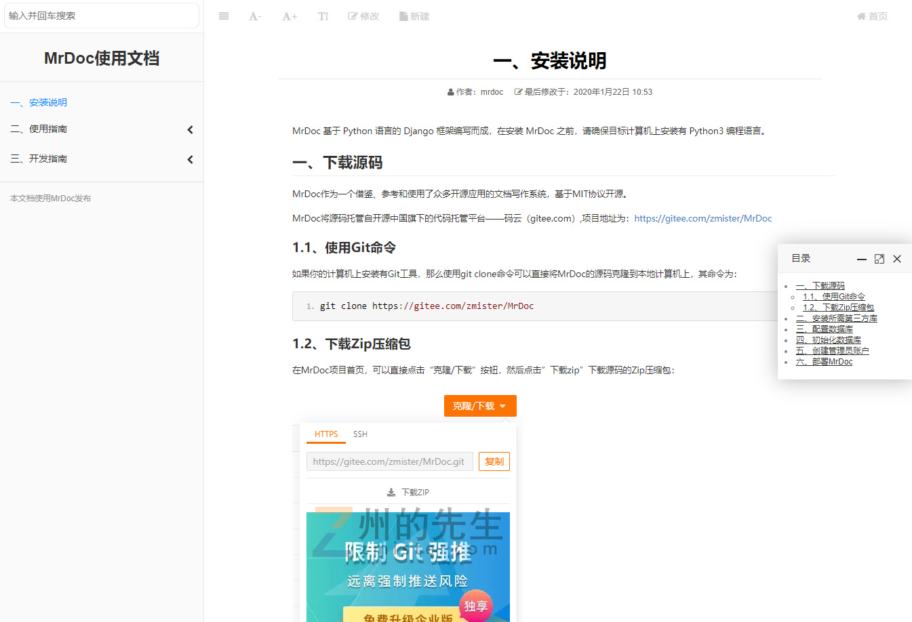
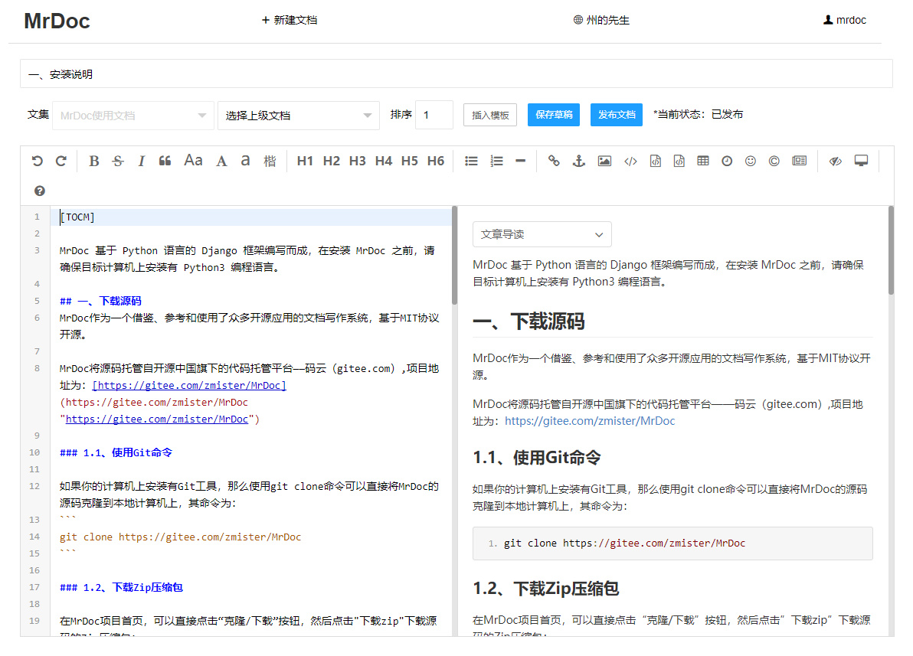
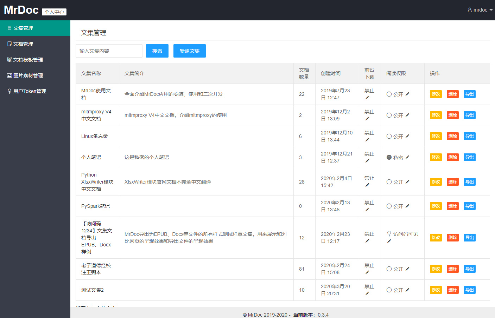

## MrDoc - 记录文档，汇聚思想


## 介绍

基于Python编写的文档写作系统，适合作为文档、知识和笔记管理工具。

MarkDown快速书写，两栏式阅读布局，清晰高效浏览。

当前版本为：**v0.3.4**，版本发布时间为**2020-04-03**

完整更新记录详见：[CHANGES.md](./CHANGES.md)

MrDoc拥有以下特点：

- 简洁的站点与用户系统
    - 支持用户注册、用户登录、用户管理、管理员等控制等功能；
    - 支持全站关闭注册；
    - 支持注册邀请码配置；
    - 支持广告位自定义配置；
    - 支持统计代码自定义配置；
    
- 结构清晰地文档系统
    - 基于文集的文档撰写和阅读；
    - 基于Editormd的Markdown编辑器，支持Markdown语法的文档写作，支持图片粘贴上传，支持从本地MD文件中插入内容；
    - 提供文档模板功能，支持文档模板的创建、修改；
    - 仿GitBook文档阅读页面，支持文档阅读页面的字体缩放，字体类型修改，页面社交分享，良好的移动端阅读体验；
    - 支持三级目录层级显示；
    - 支持文集后台导出为markdown文本格式.md文件、前台导出为EPUB电子书；
    - 基于文集进行权限控制，提供公开、私密、指定用户可见、访问码可见4种权限模式；
    - 支持基于账户的API接口，可以借助账户token通过API获取文集、上传图片和创建文档；
    - 支持文集协作功能，一个文集可以拥有一个创建者和多个协作者，可灵活选择协作权限；

在开发过程中，参考和借鉴了GitBook、ShowDoc、Wordbook等应用和网站的功能与样式，并使用了众多开源组件、插件。

## 应用核心依赖环境

MrDoc基于Python语言的Django Web框架配合前端的LayUI、JQuery等库进行开发。

后端环境推荐使用Python3.4+、Django2.1+的版本。

## 安装简明教程

### 1、安装依赖库
```
pip install -r requirements.txt
```

### 2、配置数据库信息

默认情况下，MrDoc使用Django的SQLite数据库，如果你使用Sqlite数据库，则无需另外配置数据库。

如果有配置其他数据库的需求，请在/MrDoc/MrDoc目录下打开settings.py文件，在约80行的位置，将如下代码：
```
DATABASES = {
 'default': {
 'ENGINE': 'django.db.backends.sqlite3',
 'NAME': os.path.join(BASE_DIR, 'db.sqlite3'),
 }
}
```
按照自己数据库的信息，将其修改如下格式，下面以MySQL为例：
```
DATABASES = {
 'default': {
 'ENGINE': 'django.db.backends.mysql', # 使用的数据库后端
 'NAME': 'mrdoc', # 数据库名
 'USER':'root', # 数据库用户
 'PASSWORD':'123456789', # 数据库用户密码
 'HOST':'', # 数据库主机地址
 'PORT':'3306', # 数据库端口
 }
}
```
### 3、初始化数据库

在安装完所需的第三方库并配置好数据库信息之后，我们需要对数据库进行初始化。

在项目路径下打开命令行界面，运行如下命令生成数据库迁移：
```
python manage.py makemigrations
```
接着，运行如下命令执行数据库迁移：
```
python manage.py migrate
```
执行完毕之后，数据库就初始化完成了。

### 4、创建管理员账户
在初始化完数据库之后，需要创建一个管理员账户来管理整个MrDoc，在项目路径下打开命令行终端，运行如下命令：
```
python manage.py createsuperuser
```
按照提示输入用户名、电子邮箱地址和密码即可。
### 5、测试运行
在完成上述步骤之后，即可运行使用MrDoc。

在测试环境中，可以使用Django自带的服务器运行MrDoc，其命令为：
```
python manage.py runserver
```

## 使用说明文档

详见MrDoc使用文档:http://mrdoc.zmister.com


## 问题提交和反馈

### 1、提交issue

直接在https://gitee.com/zmister/MrDoc/issues 页面提交问题。

### 2、加入MrDoc交流群

加入MrDoc交流QQ群，群号为**735507293**，入群密码：**mrdoc**


## 更多应用截图

### 首页


### 文集页


### 文档界面


### 文档编写界面


### 普通用户后台界面


### 管理员后台界面


### 登录界面


### 注册界面

