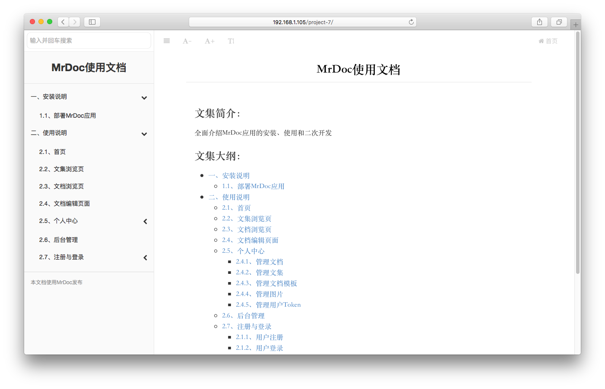
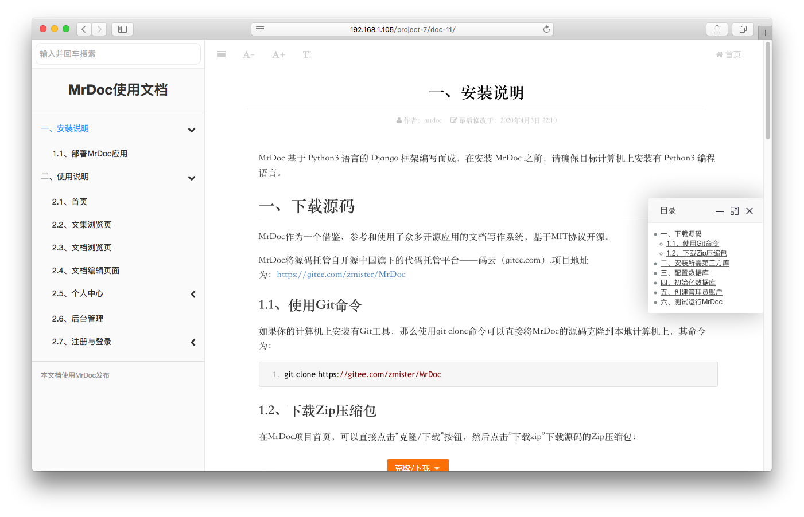
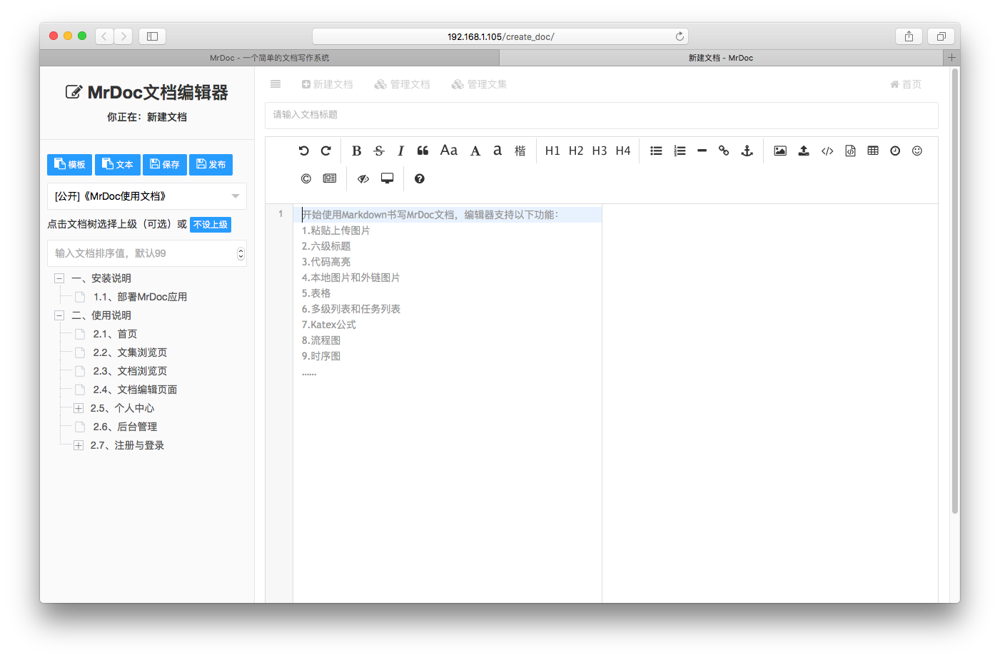
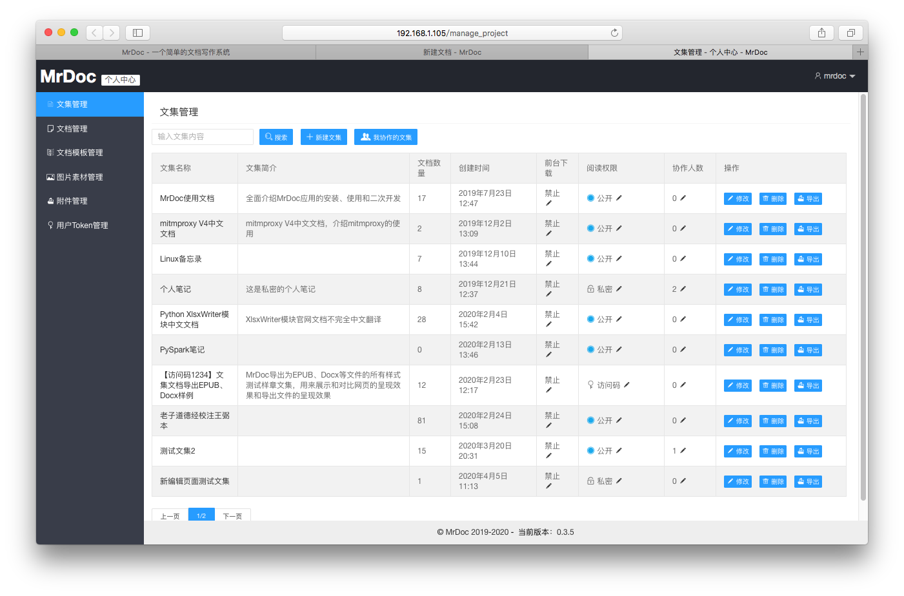
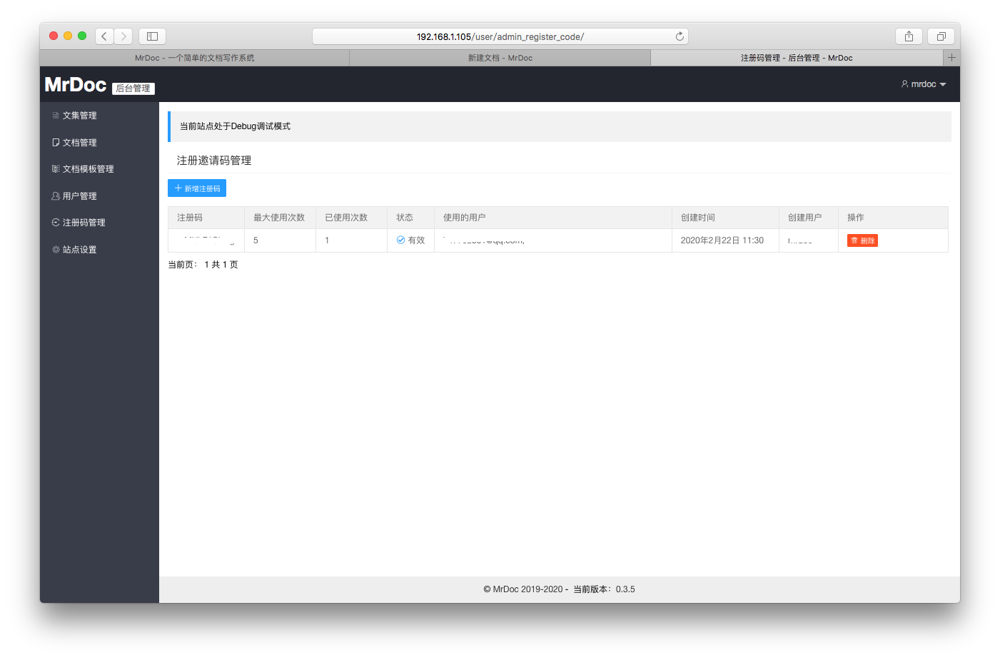
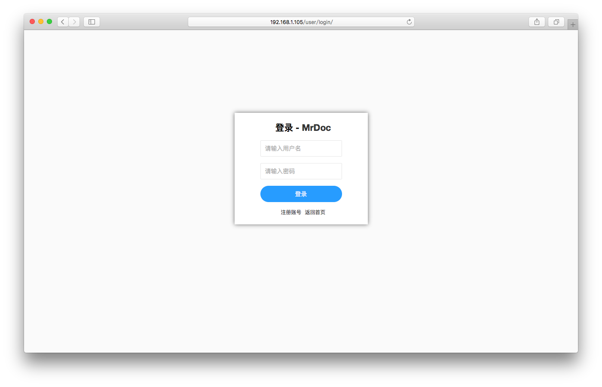
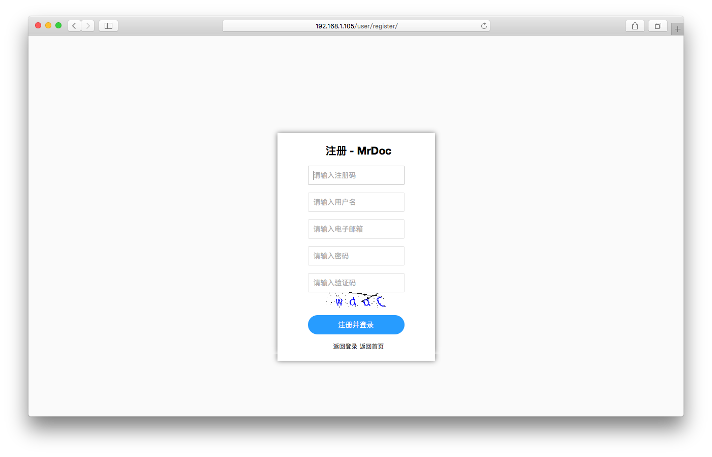

## 觅道文档MrDoc - 记录文档，汇聚思想


## 介绍

`MrDoc`是基于`Python`开发的在线文档系统，适合作为个人和小型团队的文档、知识和笔记管理工具。

## 开源地址

**Gitee:** [https://gitee.com/zmister/MrDoc](https://gitee.com/zmister/MrDoc)

**GitHub:** [https://github.com/zmister2016/MrDoc](https://github.com/zmister2016/MrDoc)

## 特性：

- **站点与用户系统**
    - 支持用户注册、用户登录、用户管理、管理员等基础用户功能；
    - 支持注册邀请码配置、广告代码配置、统计代码配置、邮箱找回密码、全站关闭注册等管理功能；
    
- **文档系统**
    - 基于文集进行文档撰写和阅读，拥有**文集**、**文档**、**文档模板**、**图片**和**附件**5大模块；
    - 使用基于`Editormd`的`Markdown`编辑器并扩展，以`Markdown`语法进行文档写作：
        - 支持**基础Markdown语法**
        - 支持**GFM语法**
        - 优化**图片上传**，支持粘贴上传、本地文件上传和图片管理插入
        - 优化**表格写入**，支持编辑HTML表格转为Markdown、Excel内容粘贴为Markdown
        - 支持**思维导图**，以Markdown的语法创建思维导图
        - 支持流程图、时序图的绘制；
    - 两栏式**文档阅读**页面、三级目录层级显示，文档阅读字体缩放，字体类型切换，页面社交分享，移动端阅读优化；
    - 支持文集**导出打包**，包括`markdown`文本格式`.md`文件、`EPUB`电子书格式文件和PDF格式文件；
    - 基于文集进行**文档权限**控制，提供公开、私密、指定用户可见、访问码可见4种权限模式；
    - 支持基于账户的**`API`接口**，可以借助账户`token`通过`API`获取文集、上传图片和创建文档；
    - 支持**文集协作**功能，一个文集可以拥有一个创建者和多个协作者，可灵活选择协作权限；
    - 支持**文档历史版本**功能，可以查看和对比历史版本与现有版本的差异，恢复某个历史版本为当前版本；

当前版本为：**v0.5.0**，版本发布时间为**2020-05-02**

完整更新记录详见：[CHANGES.md](./CHANGES.md)

在开发过程中，参考和借鉴了GitBook、ShowDoc、Wordbook等应用和网站的功能与样式，并使用了众多开源组件、插件。

## 应用核心依赖环境

`MrDoc`基于`Python`语言的`Django Web`框架配合前端的`LayUI`、`JQuery`等库进行开发。

`MrDoc`在`Python3.6` + `Django 2.2`上进行开发，并且在Django 2.1、2.2和Python3.5、3.6、3.7上测试运行良好，在其他环境下运行MrDoc不排除有未知的异常。。

## 简明安装教程

### 1、安装依赖库
```
pip install -r requirements.txt
```

### 2、配置数据库信息

默认情况下，MrDoc使用Django的SQLite数据库，如果你使用Sqlite数据库，则无需另外配置数据库。

如果有配置其他数据库的需求，请首先按照Django官方的[数据库支持说明](https://docs.djangoproject.com/zh-hans/2.2/ref/databases/)，安装特定数据库的Python绑定库，

然后在/MrDoc/MrDoc目录下打开settings.py文件，在约80行的位置，将如下代码：

```python
DATABASES = {
 'default': {
 'ENGINE': 'django.db.backends.sqlite3',
 'NAME': os.path.join(BASE_DIR, 'db.sqlite3'),
 }
}
```

按照自己数据库的信息，将其修改如下格式，下面以MySQL为例：

```python
DATABASES = {
 'default': {
 'ENGINE': 'django.db.backends.mysql', # 使用的数据库后端
 'NAME': 'mrdoc', # 数据库名
 'USER':'root', # 数据库用户
 'PASSWORD':'123456789', # 数据库用户密码
 'HOST':'', # 数据库主机地址
 'PORT':'3306', # 数据库端口
 }
}
```

### 3、初始化数据库

在安装完所需的第三方库并配置好数据库信息之后，我们需要对数据库进行初始化。

在项目路径下打开命令行界面，运行如下命令生成数据库迁移：
```
python manage.py makemigrations
```
接着，运行如下命令执行数据库迁移：
```
python manage.py migrate
```
执行完毕之后，数据库就初始化完成了。

### 4、创建管理员账户
在初始化完数据库之后，需要创建一个管理员账户来管理整个MrDoc，在项目路径下打开命令行终端，运行如下命令：
```
python manage.py createsuperuser
```
按照提示输入用户名、电子邮箱地址和密码即可。
### 5、测试运行
在完成上述步骤之后，即可运行使用MrDoc。

在测试环境中，可以使用Django自带的服务器运行MrDoc，其命令为：
```
python manage.py runserver
```

## 使用说明文档

详见MrDoc使用文档: [http://mrdoc.zmister.com](http://mrdoc.zmister.com)

## 问题提交和反馈

### 1、提交issue

在如下页面提交问题：

- [https://gitee.com/zmister/MrDoc/issues](https://gitee.com/zmister/MrDoc/issues)
- [https://github.com/zmister2016/MrDoc/issues](https://github.com/zmister2016/MrDoc/issues)

### 2、加入MrDoc交流群

加入MrDoc交流QQ群，群号为**735507293**，入群密码：**mrdoc**

### 3、联系作者

微信（WeChat）：**taoist_ling**

## 赞赏项目

如果MrDoc对你有所帮助，欢迎给予开发者赞赏，助力项目更好发展。


## 更多应用截图

### 文集浏览页面


### 文档阅读页面


### 文档编写页面


### 普通用户个人中心


### 管理员后台页面


### 登录页面


### 注册页面


