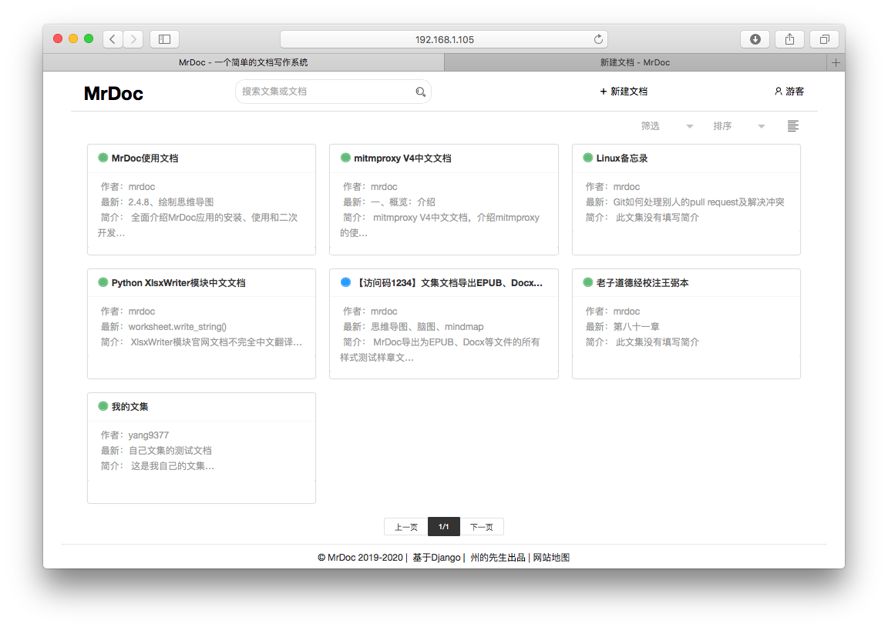

## MrDoc觅道文档 - 记录文档，汇聚思想 - [English](./README_ENG.md)

  



### 介绍

`MrDoc` 是基于`Python`开发的在线文档系统，适合作为个人和小型团队的文档、知识和笔记管理工具。致力于成为全平台（Web端、桌面端、移动端）的私有化在线文档部署方案。

目前涵盖：

- Web端，[安装手册](http://mrdoc.zmister.com/project-7/)，[使用手册](http://mrdoc.zmister.com/project-54/)；
- Chrome扩展，[使用说明](http://mrdoc.zmister.com/project-7/doc-243/)；
- App端（开发中）
- Windows、Mac、Linux桌面端（开发中）
- Windows免安装体验版，[使用说明](http://mrdoc.zmister.com/project-7/doc-249/)

### 开源地址

**码云:** <https://gitee.com/zmister/MrDoc>

**GitHub:** <https://github.com/zmister2016/MrDoc>

### 示例站点：
 <http://mrdoc.zmister.com> 可注册、可创建文集、文档，账号不定期清除，仅作测试用途，请勿编写重要文档。
 
 注册码需要关注州的先生微信公众号（ID：zmister2016），发送消息 **mrdoc注册码** 获取

### 说明文档：

[MrDoc安装手册](http://mrdoc.zmister.com/project-7/)、[MrDoc文档效果](http://mrdoc.zmister.com/project-20/)、[MrDoc使用手册](http://mrdoc.zmister.com/project-54/)

## 特性：

- **站点管理与用户管理**
    - 支持用户注册、登录、管理、管理员等基础用户功能；
    - 支持站点配置注册邀请码、广告代码、统计代码、邮箱找回密码、全站关闭注册、全站强制登录等管理功能；
    - 支持个人中心管理文集、文档、文档模板、图片、附件，支持个人中心导出文集MD文件压缩包；
    - 支持配置文集权限，提供公开、私密、指定用户可见、访问码可见4种权限模式；
    
- **文档系统**
    - 基于文集进行文档撰写和阅读，拥有**文集**、**文档**、**文档模板**、**图片**和**附件**5大模块；
    - 使用基于`Editormd`的`Markdown`编辑器优化和扩展，以`Markdown`语法进行文档写作，并支持图片管理和上传、表格粘贴、思维导图绘制、流程图绘制、序列图绘制：
    - 两栏式**文档阅读**页面、三级目录层级显示，文档阅读字体缩放，字体类型切换，页面社交分享，移动端阅读优化、文集导出PDF、EPUB文件；
    - 支持基于账户的**`API`接口**，可以借助账户`token`通过`API`获取文集、上传图片和创建文档；
    - 支持**文集协作**功能，一个文集可以拥有一个创建者和多个协作者，可灵活选择协作权限；
    - 支持**文档历史版本**功能，可以查看和对比历史版本与现有版本的差异，恢复某个历史版本为当前版本；

完整更新记录详见：[CHANGES.md](./CHANGES.md)

在开发过程中，参考和借鉴了GitBook、ShowDoc、Wordbook等应用和网站的功能与样式，并使用了众多开源组件、插件。

## 应用核心依赖环境

`MrDoc`基于`Python`语言的`Django Web`框架配合前端的`LayUI`、`JQuery`等库进行开发。

`MrDoc`在`Python 3.6` + `Django 2.2`上进行开发，并且在Django 2.1、2.2和Python3.5、3.6、3.7上测试运行良好，在其他环境下运行MrDoc不排除有未知的异常。

## 简明安装教程

### 1、安装依赖库
```
pip install -r requirements.txt
```

### 2、配置数据库信息

默认情况下，MrDoc使用Django的SQLite数据库，如果你使用Sqlite数据库，则无需另外配置数据库。

如果有配置其他数据库的需求，请首先按照Django官方的[数据库支持说明](https://docs.djangoproject.com/zh-hans/2.2/ref/databases/)，安装特定数据库的Python绑定库，

然后在/MrDoc/config目录下打开conig.ini文件，根据自己的数据库信息进行修改：

```python
# engine，指定数据库类型，接受sqlite、mysql、oracle、postgresql
engine = sqlite
# name表示数据库的名称
# name = db_name
# user表示数据库用户名
# user = db_user
# password表示数据库用户密码
# password = db_pwd
# host表示数据库主机地址
# host = db_host
# port表示数据库端口
# port = db_port
```

### 3、初始化数据库

在安装完所需的第三方库并配置好数据库信息之后，我们需要对数据库进行初始化。

在项目路径下打开命令行界面，运行如下命令生成数据库迁移：

```
python manage.py makemigrations 
```

运行如下命令执行数据库迁移:

```
python manage.py migrate
```
执行完毕之后，数据库就初始化完成了。

### 4、创建管理员账户
在初始化完数据库之后，需要创建一个管理员账户来管理整个MrDoc，在项目路径下打开命令行终端，运行如下命令：
```
python manage.py createsuperuser
```
按照提示输入用户名、电子邮箱地址和密码即可。
### 5、测试运行
在完成上述步骤之后，即可运行使用MrDoc。

在测试环境中，可以使用Django自带的服务器运行MrDoc，其命令为：

```
python manage.py runserver
```

## 问题提交和反馈

### 1、提交issue

在如下页面提交问题：

- [https://gitee.com/zmister/MrDoc/issues](https://gitee.com/zmister/MrDoc/issues)
- [https://github.com/zmister2016/MrDoc/issues](https://github.com/zmister2016/MrDoc/issues)

### 2、加入MrDoc交流群

加入MrDoc交流QQ群:

- 群1（付费） **735507293** [](http://shang.qq.com/wpa/qunwpa?idkey=143c23a4ffbd0ba9137d2bce3ee86c83532c05259a0542a69527e36615e64dba) 
- 群2（免费） **849206042**，入群密码：**mrdoc** [](http://shang.qq.com/wpa/qunwpa?idkey=4f71054b9a644e3263f695d5f17735ce39063ad7ed4fd5b4e2c5da1ac465e53a)

### 3、联系作者

微信（WeChat）：**taoist_ling**

公众号：**zmister2016**

博客：<https://zmister.com>

## 赞赏项目

开源不易，需要鼓励，如果MrDoc觅道文档对你有所帮助，请给予一个`Star`。

欢迎给予开发者赞赏，助力项目更好发展。

**Paypal:**<https://paypal.me/zmister>

