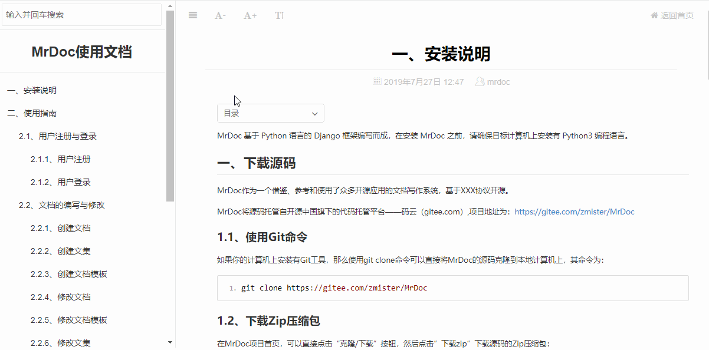
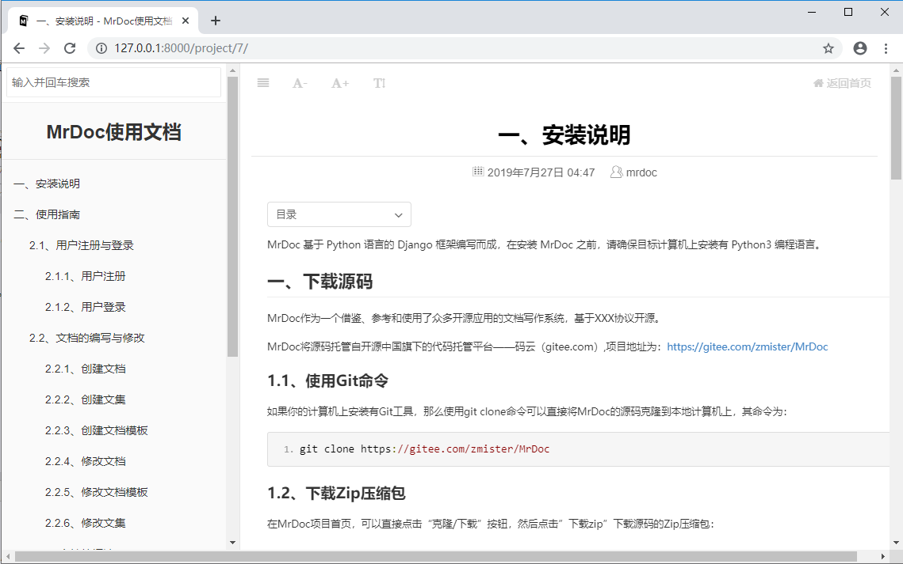
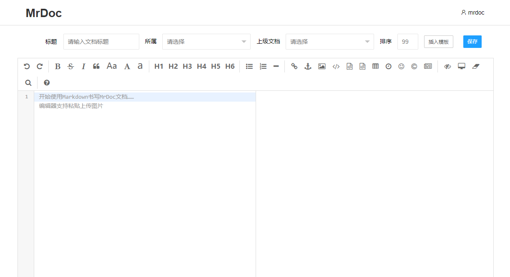
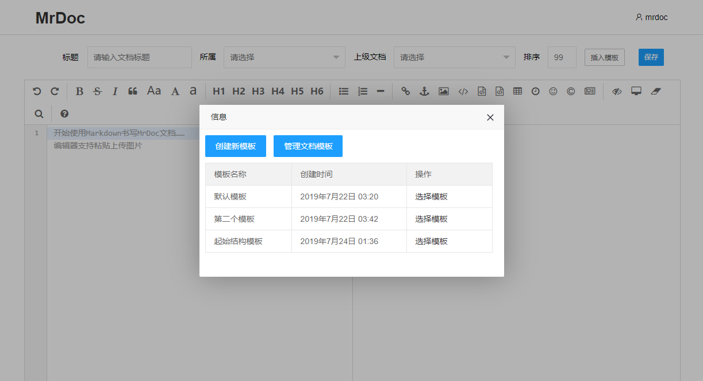
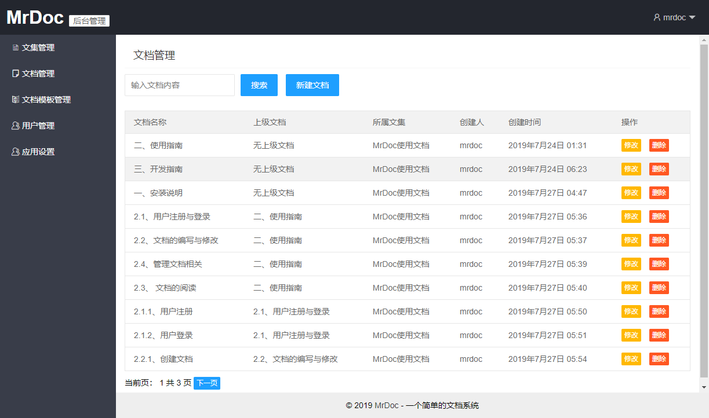
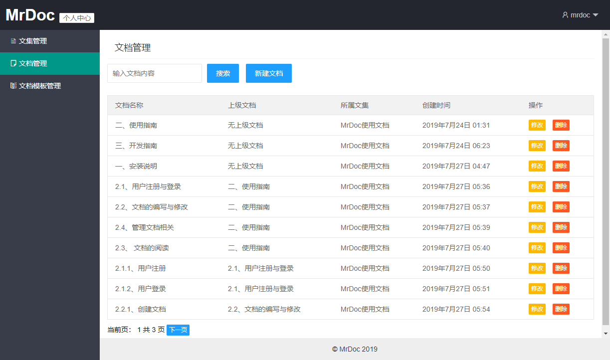

# MrDoc - 一个简单的文档写作应用

**PC端文档阅读界面：**



## 介绍

州的先生（zmister.com）自用并完全开源、基于Python编写的文档写作系统。

当前版本为：**v0.3.0**，版本发布时间为**2020-03-07**，更新记录详见：[CHANGES.md](./CHANGES.md)

MrDoc拥有以下特点：

- 站点与用户系统简洁
    - 基于Django自带的用户模型，实现简单高效的用户管理，支持用户注册、用户登录、管理员等控制等功能；
    - 支持全站关闭注册；
    - 支持注册邀请码配置；
    - 支持广告位自定义配置；
    - 支持统计代码自定义配置；
    
- 文档系统清晰
    - 基于文集的文档撰写和阅读；
    - 基于Editormd的Markdown编辑器，支持Markdown语法的文档写作，支持图片粘贴上传，支持从本地MD文件中插入内容；
    - 提供文档模板功能，支持文档模板的创建、修改；
    - 仿GitBook文档阅读页面，支持文档阅读页面的字体缩放，字体类型修改，页面社交分享，良好的移动端阅读体验；
    - 支持三级目录层级显示；
    - 支持文集后台导出为markdown文本格式.md文件、前台导出为EPUB电子书；
    - 基于文集进行权限控制，提供公开、私密、指定用户可见、访问码可见4种权限模式；
    
- 二次开发方便
    - 使用Django传统的MTV开发模式，路由、视图函数、模型易于理解；
    - 使用非前端工程化构建前端页面，主要使用Layui进行页面布局和展示，方便改动；


在开发过程中，参考和借鉴了GitBook、ShowDoc、Wordbook等应用和网站的功能与样式。

## 网站架构

- 编程语言：Python 3
- 后端Web框架：Django 2.1
- 前端UI库：Layui 2.5.4
- JS库：Jquery
- MarkDown编辑器：Editormd
- 页面社交分享：Share.js
- Markdown科学公式：Katex.js

## 安装教程

### 1、安装依赖库
```
pip install -r requirements.txt
```

### 2、配置数据库信息
默认情况下，MrDoc使用Django的SQLite数据库，在旧版本MrDoc附带了一个Sqlit数据库，如果你使用的是MrDoc源码附带的Sqlite数据库，或使用Sqlite数据库，则无需另外配置数据库。
如果有配置其他数据库的需求，请在/MrDoc/MrDoc目录下打开settings.py文件，在约80行的位置，将如下代码：
```
DATABASES = {
 'default': {
 'ENGINE': 'django.db.backends.sqlite3',
 'NAME': os.path.join(BASE_DIR, 'db.sqlite3'),
 }
}
```
按照自己数据库的信息，将其修改如下格式，下面以MySQL为例：
```
DATABASES = {
 'default': {
 'ENGINE': 'django.db.backends.mysql', # 使用的数据库后端
 'NAME': 'mrdoc', # 数据库名
 'USER':'root', # 数据库用户
 'PASSWORD':'123456789', # 数据库用户密码
 'HOST':'', # 数据库主机地址
 'PORT':'3306', # 数据库端口
 }
}
```
### 3、初始化数据库
在安装完所需的第三方库并配置好数据库信息之后，我们需要对数据库进行初始化。

在项目路径下打开命令行界面，运行如下命令生成数据库迁移：
```
python manage.py makemigrations
```
接着，运行如下命令执行数据库迁移：
```
python manage.py migrate
```
执行完毕之后，数据库就初始化完成了。

### 4、创建管理员账户
在初始化完数据库之后，需要创建一个管理员账户来管理整个MrDoc，在项目路径下打开命令行终端，运行如下命令：
```
python manage.py createsuperuser
```
按照提示输入用户名、电子邮箱地址和密码即可。
### 5、测试运行
在完成上述步骤之后，即可运行使用MrDoc。

在测试环境中，可以使用Django自带的服务器运行MrDoc，其命令为：
```
python manage.py runserver
```

## 使用说明

详见MrDoc使用文档:http://mrdoc.zmister.com

## 二次开发说明

详见MrDoc使用文档:http://mrdoc.zmister.com

## 问题提交和反馈

### 1、提交issue

直接在https://gitee.com/zmister/MrDoc/issues 页面提交问题。

### 2、加入MrDoc交流群

加入MrDoc交流QQ群，群号为735507293，入群密码：mrdoc


## 版本更新

关注州的先生微信公众号（ID：zmister2016）、博客 https://zmister.com，及时获取MrDoc版本更新信息。

## 更多截图

### 文档界面


### 登录界面


### 注册界面


### 文档写作界面


### 文档模板界面


### 管理员后台界面


### 普通用户后台界面
